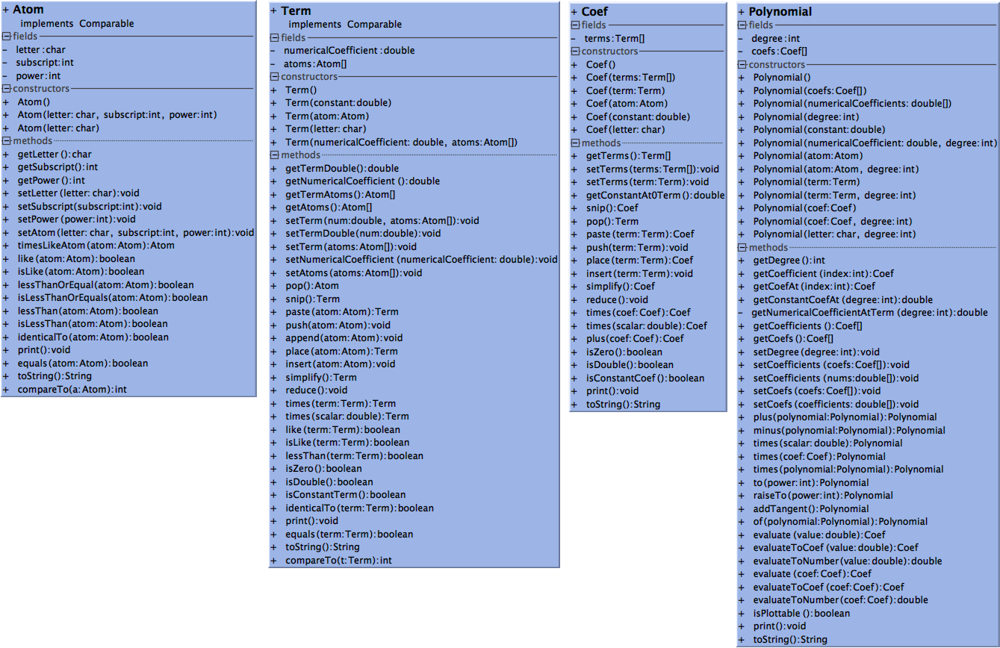

# Polyfun 1.1.0

Refactored version of David Gomprecht's polyfun 1.0.0 library which was compiled in Java 6.

Download [polyfun-1.1.0 jar](https://github.com/kjergens/polyfun_v_2/raw/master/out/artifacts/polyfun_1_1_0/polyfun-1.1.0.jar).
See [Javadocs](https://kjergens.github.io/polyfun-1.1.0/out/html/org/dalton/polyfun/Polynomial.html)

## Change log
These changes were made to be backward compatible. In other words, old XClass code will work with this updated library.
* Compiled in Java 11
* Updated variable names to be descriptive, e.g. `double var2` became `double numericalCoefficient`.
  * Attributes are private, with access only through getters and setters, therefore changing attribute names does not affect the user interface.
  * Descriptive parameter names should help users know arguments are expected.
* Added getters and setters to reflect new variable names, e.g. `getDouble()` became `getNumericalCoefficient()`.
  * The original getters and setters were not removed, but they were marked as deprecated.
* Added setters where they were missing.
* In each class, arranged methods in following order:
  * Constructors
  * Getters
  * Setters
  * other methods
    * overloaded methods grouped together
  * equals
  * toString
* Simplified `if (<condition>) return true; else return false;` to `return <condition>;`.
  * IntelliJ code analyzer recommended this change.
* Where objects were instantiated with the default constructor then set the attributes individually using setters, changed to creating the object with a constructor that sets all the attributes.
* Where a statement appeared in all if-if-else-else blocks, that statement was pulled out to below the if-else block.
* Where for-loops copied arrays, replaced with System.arraycopy.
  * IntelliJ code analyzer recommended this change.
* Where a method looked for a non-zero value in an array, updated it from counting all the non-zero elements then returning true if count > 0, to instead return false at the first occurrence of a non-zero element.
* Where a method returned a new object by declaring and instantiating on one line, and returning on the next line, changed to returning an anonymous object instantiating on the same line.
* Added toString() methods and put deprecation warning for print() methods.
* Added equals() methods to Atom and Term and put deprecation warning on identicalTo() methods.
* Throughout the library, replaced use of deprecated methods with their newer counterparts.
* Auto-reformatted code.
* The sort was hard to find a pattern for, so created a new intra-Coef sort order for terms, E.g. (a_1+c_2+5)X.
    * Sorts the atoms, then compares alphanumerically. Ignores the numerical coefficient.
    * Unless there are no atoms, then just sorts by constant.
    * For a mix of atoms and constant, the constant is "greater" so that it comes last.
* Added Junit tests
* Added class diagrams (see below).

